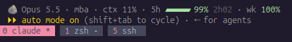

# 🪨 claude-caveman-statusline

A compact, Codex-style status line for [Claude Code](https://docs.claude.com/en/docs/claude-code) that shows the [caveman](https://github.com/JuliusBrussee/caveman) mode badge, the current model, context usage, and **how much of your 5-hour and weekly usage is left**, as a colored progress bar.



It's one small Bash script and needs no background process, API calls, or token handling.

## Features

- **Caveman badge**: 🪨 when caveman mode is on, 🪨LITE / 🪨ULTRA for other levels, and hidden when caveman is not installed.
- **Model and folder**: shows the active model and the current working directory.
- **Context usage**: shows the percentage of the context window used.
- **5-hour limit**: a thin progress bar of the *remaining* usage, plus the time until the window resets.
- **Weekly limit**: shows the remaining weekly usage as a percentage.
- **Color thresholds**: green above 50% left, yellow above 20%, and red below that.
- **Graceful fallback**: any field that Claude Code doesn't send is hidden instead of causing an error.

## Requirements

| Requirement | Notes |
|---|---|
| Linux (or macOS with GNU `date`) | Bash 4+ |
| [`jq`](https://jqlang.github.io/jq/) | `sudo apt install jq` / `sudo dnf install jq` |
| Claude Code **2.1.80+** | Needed for the `rate_limits` data |
| Claude **Pro / Max** login | Usage bars only appear for subscribers, after the first message in a session |
| [caveman](https://github.com/JuliusBrussee/caveman) plugin | *Optional*, only needed for the 🪨 badge |

## Installation

### 1. Get the script

```bash
curl -fsSL https://raw.githubusercontent.com/MBaranekTech/claude-caveman-statusline/main/statusline.sh \
  -o ~/.claude/statusline.sh
chmod +x ~/.claude/statusline.sh
```

### 2. Register it in `~/.claude/settings.json`

Open the config file:

```bash
nano ~/.claude/settings.json
```

**If the file is empty or doesn't exist**, paste this:

```json
{
  "statusLine": {
    "type": "command",
    "command": "~/.claude/statusline.sh",
    "padding": 0
  }
}
```

**If you already have settings**, add `statusLine` as a **top-level key**, at the same indentation as keys like `"model"`, `"theme"` or `"tui"`. Don't put it inside another block such as `enabledPlugins` or `autoMode`. For example, put it right after `"theme"`:

```jsonc
{
  "model": "opus",
  "enabledPlugins": { ... },
  "tui": "fullscreen",
  "theme": "dark",
  "statusLine": {                          // 👈 add this block
    "type": "command",
    "command": "~/.claude/statusline.sh",
    "padding": 0
  },                                       // 👈 comma, because another key follows
  "autoMode": { ... }
}
```

> ⚠️ Mind the commas: every key except the last one needs a `,` after it. If you add `statusLine` as the **last** key, remove its trailing comma and make sure the key before it ends with `,`.

In nano, save with **Ctrl+O**, press **Enter**, and exit with **Ctrl+X**.

Validate the file:

```bash
jq . ~/.claude/settings.json > /dev/null && echo OK
```

### 3. (Optional) Install caveman

```bash
claude plugin marketplace add JuliusBrussee/caveman
claude plugin install caveman@caveman
```

### 4. Restart Claude Code

The status line appears at the bottom of the screen.

## Test without Claude Code

```bash
echo '{"model":{"display_name":"Opus"},"workspace":{"current_dir":"/home/me/proj"},"context_window":{"used_percentage":34},"rate_limits":{"five_hour":{"used_percentage":40,"resets_at":'$(( $(date +%s)+7800 ))'},"seven_day":{"used_percentage":72}}}' \
  | ~/.claude/statusline.sh
```

Expected output:

```
🪨 Opus · proj · ctx 34% · 5h ▰▰▰▱▱ 60% 2h10 · wk 28%
```

## How it works

On every refresh, Claude Code pipes a JSON object with session data to the script on stdin, and the script prints a single line. The status line reads these fields:

| Field | Shown as |
|---|---|
| `model.display_name` | Model name |
| `workspace.current_dir` | Folder name |
| `context_window.used_percentage` | `ctx N%` |
| `rate_limits.five_hour.used_percentage` / `resets_at` | `5h` bar and reset countdown |
| `rate_limits.seven_day.used_percentage` | `wk N%` |

The caveman plugin's SessionStart hook writes the current mode to `~/.claude/.caveman-active` (or `$CLAUDE_CONFIG_DIR/.caveman-active`), and the script reads that file to show the badge.

## Customization

Edit `~/.claude/statusline.sh`. Changes apply on the next refresh, without a restart.

| Want to… | Do this |
|---|---|
| Hide context % | Delete the `[ -n "$ctx" ]` line |
| Hide folder name | Remove `· ${dir}` from the `out=` line |
| Wider bar | Change `w=5` in `bar()` |
| Different bar style | Replace `▰` / `▱` with `█` / `░` or `●` / `○` |
| No emoji | Replace `🪨` with `CM` |
| Change thresholds | Edit the numbers in `col()` |

## Troubleshooting

**No usage bars.** You may be logged in with an API key instead of a Pro/Max account (check with `claude auth status`), or no message has been sent yet in the session. Update Claude Code with `claude update`.

**No 🪨 badge.** Start a new session so the caveman hook writes its flag file, then check it with `cat ~/.claude/.caveman-active`. Inside Claude Code, run `/hooks` to confirm that caveman's SessionStart hook is registered.

**Status line doesn't appear.** Make sure `settings.json` is valid JSON and the script is executable (`chmod +x`). Pipe the test JSON above into the script to see any errors.

**Caveman replaced my status line.** On first run, the caveman plugin may offer to set up its own status line. Decline, or point `statusLine.command` back to this script.

## How it was made

I built this in a conversation with Claude. I started from the idea of a Codex-like status bar in Claude Code with the caveman badge and remaining-usage progress bars. Then I iterated on it in my real terminal, fixing a doubled `CAVEMAN:CAVEMAN` badge and making the layout less crowded, until it looked right.

## Credits

- [caveman](https://github.com/JuliusBrussee/caveman) by Julius Brussee, for the 🪨 mode and its flag file
- [Claude Code](https://docs.claude.com/en/docs/claude-code) status line API by Anthropic

This project is not affiliated with Anthropic or the caveman project.

## License

[MIT](LICENSE)

---

<details>
<summary>📄 Full script (<code>statusline.sh</code>)</summary>

```bash
#!/usr/bin/env bash
# claude-caveman-statusline
# Compact Claude Code status line: caveman badge, model, folder,
# context usage, and remaining 5-hour / weekly usage.
# Requires: jq, Claude Code >= 2.1.80 (usage bars need Pro/Max login)

input=$(cat)
j() { echo "$input" | jq -r "$1 // empty"; }

model=$(j '.model.display_name')
dir=$(basename "$(j '.workspace.current_dir')")
ctx=$(j '.context_window.used_percentage')
h5=$(j '.rate_limits.five_hour.used_percentage')
d7=$(j '.rate_limits.seven_day.used_percentage')
r5=$(j '.rate_limits.five_hour.resets_at')

# Color by remaining %: green > 50, yellow > 20, red otherwise
col() { local l=$1; ((l > 50)) && echo 32 || { ((l > 20)) && echo 33 || echo 31; }; }

# Thin 5-segment bar of REMAINING usage
bar() {
  local left=$((100 - ${1%.*})) w=5 s="" i; ((left < 0)) && left=0
  local fill=$(( (left * w + 50) / 100 ))
  for ((i=0; i<w; i++)); do ((i < fill)) && s+="▰" || s+="▱"; done
  printf '\e[%sm%s %d%%\e[0m' "$(col $left)" "$s" "$left"
}

# Caveman badge (plain for default mode, level shown otherwise)
cave=""
f=${CLAUDE_CONFIG_DIR:-$HOME/.claude}/.caveman-active
if [ -f "$f" ]; then
  mode=$(tr -d '[:space:]' < "$f" | tr '[:upper:]' '[:lower:]')
  case "$mode" in ""|full|caveman|on) tag="🪨" ;; *) tag="🪨${mode^^}" ;; esac
  cave="$tag "
fi

# Time until the 5-hour window resets (epoch or ISO timestamp)
reset=""
if [ -n "$r5" ]; then
  [[ $r5 =~ ^[0-9]+$ ]] && ts=$r5 || ts=$(date -d "$r5" +%s 2>/dev/null)
  [ -n "$ts" ] && { m=$(( (ts - $(date +%s)) / 60 )); ((m < 0)) && m=0; reset=" \e[2m$((m/60))h$(printf %02d $((m%60)))\e[0m"; }
fi

out="${cave}${model} · ${dir}"
[ -n "$ctx" ] && out+=" · ctx ${ctx%.*}%"
[ -n "$h5" ]  && out+=" · 5h $(bar "$h5")${reset}"
if [ -n "$d7" ]; then
  wl=$((100 - ${d7%.*}))
  out+=" · wk \e[$(col $wl)m${wl}%\e[0m"
fi
printf '%b\n' "$out"
```

</details>
